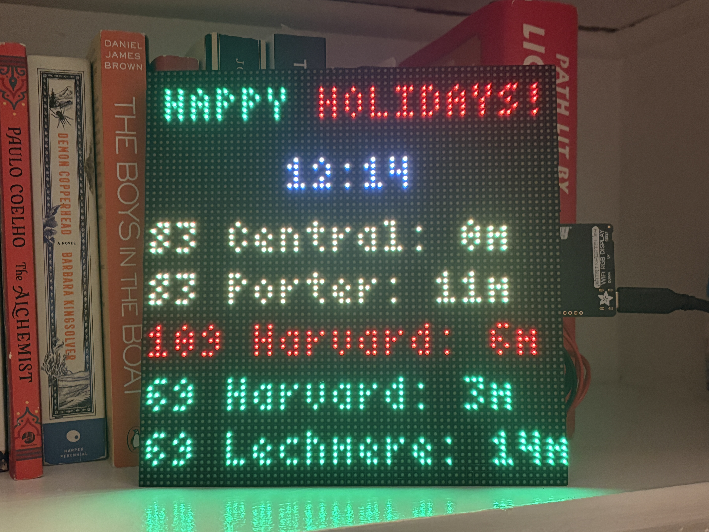

# mbta-live

Get live updates from MTBA bus routes displayed on an LED board!



### Hardware

[Adafruit MatrixPortal](https://www.adafruit.com/product/4745) and a [HUB75 LED board](https://www.adafruit.com/product/4732).

### Setup

1. Make sure the ESP32 NINA firmware on your MatrixPortal is updated so it can handle HTTPS requests
    
    a. Connect the MatrixPortal device to your computer
    
    b. Double-click the RESET button to enter the bootloader mode
    
    c. Copy over `firmware/MatrixPortal_M4_ESP32_Passthrough_TinyUSB_2023_07_30.uf2` to the device's drive that appears on your computer
    
    d. `pip install esptool`
    
    e. `ls /dev/tty.*` to determine the usb-port your device is connected to
    
    f. `esptool.py --port /dev/tty.<insert_usb_port> --before no_reset --after no_reset --baud 115200 write_flash 0 firmware/NINA_ADAFRUIT-esp32-3.2.0.bin`

2. Format your MatrixPortal with a CircuitPython version found in `circuitpython-versions` (verified as working), or whatever latest version is available online

    a. Copy the .uf2 file over to the MatrixPortal drive as it appears on your desktop

    b. The drive will now appear as CIRCUITPY

3. Create a `settings.toml` file, and include CIRCUITPY_WIFI_SSID, CIRCUITPY_WIFI_PASSWORD, and MBTA_API_KEY. Copy the `settings.toml` file over to CIRCUITPY. 

    a. Get an API key from the [MBTA](https://api-v3.mbta.com/)

    b. The file should look like this:

    ```
    CIRCUITPY_WIFI_SSID = "****"
    CIRCUITPY_WIFI_PASSWORD = "****"
    MBTA_API_KEY = "****"
    ```

4. Copy over the `fonts/` direcectory to the CIRCUITPY drive

5. Replace the contents of the CIRCUITPY's `circuitpy-lib/` directory with the one in this repo

6. Replace the contents of the CIRCUITPY's `code.py` with the `code.py` from this repo

    a. If you are not using a 64x64 LED board with a fifth `E` pin, you will need to modify the definition of the `matrix` object

    b. You can find the stop IDs of bus/T stops you prefer by clicking on the stop's icon in Google Maps on web (not mobile)

7. The code will now run whenever the board is connected to sufficient USB-C power :) 

Alternative instructions for steps [1](https://learn.adafruit.com/upgrading-esp32-firmware/upgrade-all-in-one-esp32-airlift-firmware) and [2](https://learn.adafruit.com/adafruit-pyportal/install-circuitpython) from Adafruit.

### Attributions

4x6 font (it's really 3x5!) from [Janne V. Kujala](https://github.com/IT-Studio-Rech/bdf-fonts/blob/main/4x6.bdf), converted to PCF thanks to [Adafruit](https://adafruit.github.io/web-bdftopcf/)

Thanks to Adafruit for hardware.

### Dev Notes

Connect to board terminal: `minicom -b 115200 -o -D /dev/tty.<insert_usb_port>`

TODO: issue where board shuts off after being on for awhile (logic error? OOM?)